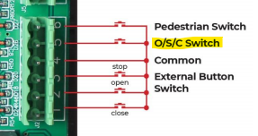
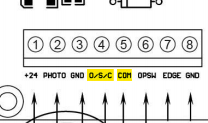
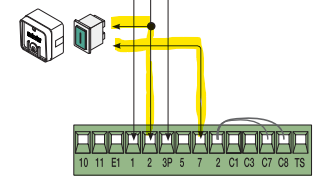
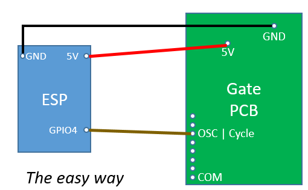
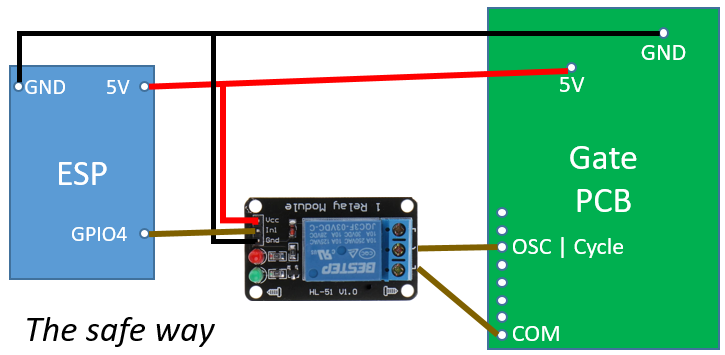
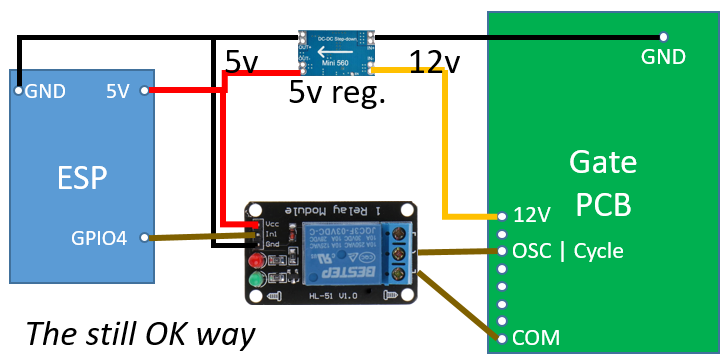
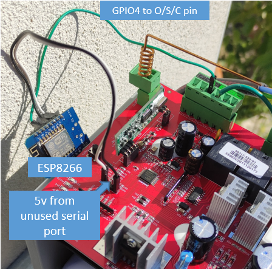

&nbsp;

&nbsp;

&nbsp;

<b>ESPGate</b> is a solution to control your electric gate with HomeAssistant using just an <b>ESP8266 or ESP32</b>.

_If this project has any value for you, please consider <b>[buying me a 🍺](https://www.buymeacoffee.com/raomin)</b>!. I don't do this for money but it feels good to get some support! Thanks :)_ 

## Features

  <ul style="list-style-position: inside;">
    <li>Needs just an ESP8266 or ESP32, no need for extra hardware.</li>
    <li>Easily integrates with Home Assistant's MQTT auto-discovery.</li>
    <li>Supports update OverTheAir</li>
</ul>

# Prerequisites

## Hardware

- An electric gate you want to control over Home Assistant.
- An ESP8266 or ESP32
- *Optional: one relay module.*
- *Optional: a 5v regulator / step down.*

## Software

- Platformio

# Getting started

## Step 1: Determining the connections

### Principles
1. Open your gate main board and localize with the manual the connection for the Open/Stop/Close switch. This should look like this:

Example 1             |  Example 2          |  Example 3
:-------------------------:|:-------------------------:|:-------------------------:
 |  |  

2. Determine if the connection is pulled UP or DOWN with a multimeter: Measure the voltage between COM (black gnd probe) and the O/S/C pin (red/vcc probe). If the multimeter reads 5V you have pulled UP, meaning that the OSC pin needs to be put to the GND to activate. If you read -5v the OSC pin is pulled DOWN, meaning that the OSC pin acts when receiving 5v.

3. Find some 5v for your ESP. Usually, your microcontrollers on the board will work with 5v and your ESP needs 5V to work. So probe around to find some 5V connection. Note that some 5V lines might note have enough current to power the ESP. I found mine in a serial connector on the board. 

### The easy way

### The safe way

If your voltage reading is in the range of +5v to -5v you should be able to connect your ESP directly. If you have a different value, or if you want to play safe, use a relay module (eg something like [this](https://www.aliexpress.com/item/1005001567474787.html)).

### The still ok way

If you cannot find a suitable 5V, you'll most probably find 12V (eg for the photosensors) that you'll have to regulate with a 12V -> 5V regulator (that old USB car charger that you kept somewhere, or a DC-DC 5V step down...) 

## Step 2: The soft part

1. Edit `platformio.ini` to set the right environment and board.

2. Edit the file `src/config.h` as follows:
    - Enter your wifi and mqtt settings
    - Select the GPIO output you'll use
    - Set `pullup` to 1 or 0 depending whether your OSC is PulledUP (1) or Pulled Down (0).

3. Upload. A new switch called `ESP Gate` should appear in Home Assistant.

4. Go connect your ESP, press on the switch in HA, tadaaa!

# How it looks

## On an SCS Sentinel - Opengate 2

# FAQ

#### How can I determine if the gate is opened or closed?

There is no easy way of doing this. I'm still wondering myself...

# How can I contribute?

Every contribution to this project is highly appreciated! Don't fear to create issues to report possible bugs or feature request. Pull requests which enhance or fix ESPGate are also greatly appreciated for everybody!

If this project is useful to you, and if you want, [you can buy me a beer](https://www.buymeacoffee.com/raomin)! It feels good and really helps improving ESPGate. Thanks :)

# License
ESPGate is licensed under 
